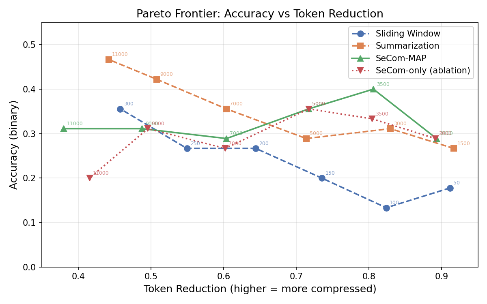
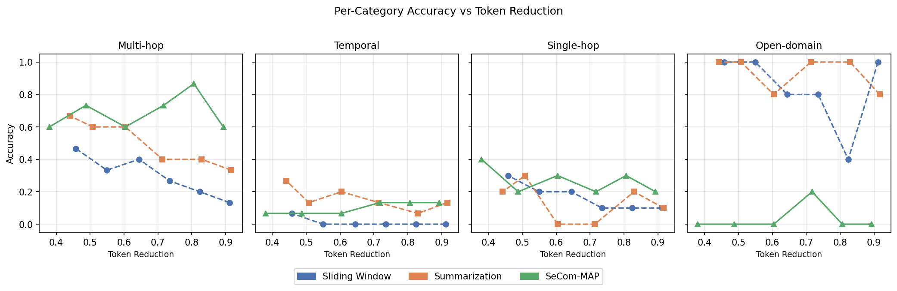
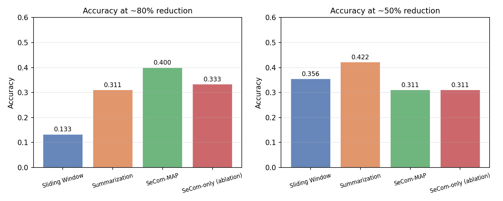

# SeCom-MAP: Semantic Compression for Long-Conversation QA

This repository benchmarks three context compression strategies for long multi-turn dialogue,
with a primary focus on **SeCom-MAP** — a retrieval-augmented approach that combines
LLMLingua-2 token compression, BM25 retrieval, and a structured ContextMap to answer
questions over conversations that far exceed any practical context window.

---

## Background: Why Context Compression?

Large language models have a hard token limit. A typical long conversation in the LoCoMo
dataset spans 25 sessions, ~500 turns, and ~16,000 tokens — 4–8× the budget a production
system might allocate to conversation history. The standard response is truncation: throw
away old turns. But early sessions often contain the most precise factual information
(who someone is, what was agreed, when something happened), so naïve truncation causes
accuracy to collapse on questions that require cross-session recall.

The core tension is:

> **More compression → fewer tokens → cheaper and faster inference**  
> **More compression → less information → worse answers**

This project maps that trade-off empirically, asking: *where exactly does each compression
strategy fall off the cliff, and is there a method that stays accurate even at high compression?*

---

## Dataset: LoCoMo

**Source:** [Maharana et al., 2024](https://arxiv.org/abs/2402.15218) — 10 long-form
conversational datasets, each spanning 25 daily sessions between two speakers.

| Property | Value |
|---|---|
| Conversations | 10 (conv0–conv9) |
| Sessions per conversation | 25 (D1–D25) |
| Avg turns per conversation | ~509 |
| Avg tokens per conversation | ~15,800 |
| QA pairs evaluated | 45 |
| Question categories | Multi-hop (15), Temporal (15), Single-hop (10), Open-domain (5) |

LoCoMo is well-suited for compression research because correct answers frequently depend
on sessions D1–D5 — the earliest, and therefore the first to be discarded or summarised
away. Multi-hop questions explicitly chain facts across sessions months apart.

---

## Methods

### Method 1 — Sliding Window

**What it does.** Keep the last N turns verbatim; discard everything older.

**Control parameter:** `N ∈ {50, 100, 150, 200, 250, 300}` turns

**Why it exists.** This is the simplest possible baseline — pure truncation, zero LLM
overhead, deterministic. It represents the floor: any serious compression method should
beat it.

**Its fundamental problem.** Once the answer-bearing turn scrolls out of the window,
the information is gone with no recovery. A question about an event from D1 cannot be
answered by a model that only sees D20–D25, regardless of how large N is.

---

### Method 2 — Budget-Fill Summarisation

**What it does.** Summarise the first half of the conversation with a single LLM call,
then greedily fill the remaining token budget with verbatim turns taken from the most
recent end of the second half.

**Control parameter:** total context budget `∈ {1500, 3000, 5000, 7000, 9000, 11000}` tokens

**Design rationale.** The natural first attempt at summarisation is to instruct the LLM
with something like "write a summary in at most 500 tokens." LLMs consistently ignore
token-count instructions in prompts — a request for a 500-token summary might produce
anything from 80 to 1200 tokens, making the compression ratio unpredictable and the
Pareto sweep impossible to control.

The budget-fill approach sidesteps this entirely: the LLM writes a summary without any
length constraint (always landing around 700–1200 tokens), and we then treat the budget
as a *total context size* limit. After generating the summary, we greedily append
verbatim recent turns (most-recent first) until the remaining token budget is exhausted.
This makes the budget a hard, predictable control over the final context size.

The summarisation prompt asks the LLM to be exhaustive — recording every name, date,
number, relationship, and decision — so that even a single summary can recover early facts.

---

### Method 3 — SeCom-MAP (Primary)

**The problem it addresses.** Summarisation condenses the entire early history into a
single lossy representation. If a question needs a specific detail that was averaged away
in the summary, there is no recovery. BM25 retrieval addresses this by keeping the full
(but compressed) history as a searchable index: instead of summarising everything into
one blob, retrieve only the segments most relevant to the current question.

**Inspired by:** [*SeCom: On the Role of Semantic Compression in Conversational Memory*
(ICLR 2025)](https://arxiv.org/abs/2501.10989)

**Control parameter:** token budget `∈ {2000, 3500, 5000, 7000, 9000, 11000}` tokens

**Three-component pipeline:**

1. **LLMLingua-2 compression** (`microsoft/llmlingua-2-bert-base-multilingual-cased-meetingbank`)

   Each conversation session (D1–D25) is independently compressed using a BERT-based
   token-level binary classifier. The classifier scores every token on its information
   value and removes low-scoring ones, producing a condensed but syntactically plausible
   version of the session. Compression happens once per session at build time and is
   cached to disk — queries never rebuild the index.

2. **BM25 retrieval index**

   The compressed sessions are stored in a BM25 index. At query time, the index ranks
   all sessions by keyword relevance to the (possibly rewritten) query and greedily
   adds top-ranked sessions to the context until the token budget is consumed. BM25 is
   recency-agnostic: a session from D2 can outrank one from D22 if it contains more
   query-relevant keywords, which is exactly what sliding window can never do.

3. **ContextMap — entity/decision/timeline tracker**

   A structured in-memory record updated session-by-session (D1 → D2 → … → D25).
   It tracks named entities (with frequency and last-seen session), key decisions, and
   a timeline of events. The ContextMap serves two roles:

   - **Entity Protection (EP):** The top-20 entities from the ContextMap are passed as
     `force_tokens` to LLMLingua-2, preventing it from discarding important names and
     dates. Sessions containing at least one tracked entity are compressed at rate 0.85
     (keeping 85% of tokens) rather than the default 0.65 (keeping 65%).
   - **Query Rewriting (QR):** Before BM25 retrieval, the raw question is enriched with
     entity context from the ContextMap. A question like "What job did he take?" becomes
     "What job did [name], who works in [field], take?" — substantially improving recall
     for pronoun-heavy or underspecified questions.

   At inference time, a rendered ContextMap summary is prepended to the retrieved context
   as a global reference, giving the LLM a structured overview even if the relevant
   session falls outside the token budget.

**Compress rate selection.** LLMLingua-2's `rate` parameter controls the fraction of
tokens *kept* (not removed). We use 0.65 by default and 0.85 for entity-protected
segments. These values were chosen to produce meaningful compression (35% reduction for
most segments) while keeping enough syntactic structure for BM25 keyword matching to
remain meaningful.

The more principled approach would be to tune `rate` per-session based on information
density (e.g. lower rate for high-entropy segments, higher for formulaic ones). In
practice, re-running LLMLingua-2 across all 10 conversations × 25 sessions requires
rebuilding the full disk cache (~30–40 minutes of CPU inference), which makes a
compress-rate sweep impractical within this scope. The token budget at *retrieval* time
already provides a smooth, cost-free control over the final context size, so we use that
as the primary Pareto parameter instead.

**Ablation — SeCom-only.** EP and QR disabled; pure BM25 retrieval over LLMLingua-compressed
sessions with no entity awareness. Used to isolate the contribution of the ContextMap components.

---

## How to Reproduce

**Prerequisites:** Python 3.10+, an OpenAI API key (for answer generation and judging).

```bash
# 1. Clone and set up the environment
git clone <this-repo>
cd secom-map-compression
make setup            # creates .venv, installs requirements.txt, clones LoCoMo dataset

# 2. Fill in your API key
cp .env.example .env
# edit .env: set OPENAI_API_KEY=sk-...

# 3. Preprocess the dataset → data/samples.json (45 QA pairs)
make data

# 4. Single fixed-parameter evaluation of all methods
make run              # python eval/run_all.py

# 5. Full Pareto sweep (6 parameter values × 4 methods, ~$12 in API cost)
make cliff            # python eval/cliff_analysis.py

# 6. Generate figures
make plot             # python analysis/plot_results.py
```

**Selective re-runs.** To re-run only specific methods without rebuilding everything:

```bash
python eval/cliff_analysis.py --methods secom_map secom_only
python eval/cliff_analysis.py --limit 10   # quick smoke-test on 10 samples
```

**Disk cache.** The first run of any SeCom variant compresses all 10 conversations with
LLMLingua-2 and saves the result to `results/secom_cache/conv*_ep{0,1}.json`. Subsequent
runs at different token budgets load from cache — no LLM calls or BERT inference needed.

**Environment variables** (in `.env`):

| Variable | Default | Description |
|---|---|---|
| `OPENAI_API_KEY` | — | Required for answer generation and judging |
| `ANSWER_MODEL` | `gpt-4o` | Model used to answer questions |
| `JUDGE_MODEL` | `gpt-4o-mini` | Model used for binary correctness scoring |
| `SUMMARIZE_MODEL` | `gpt-4o` | Model used for Method 2 summarisation |
| `LLMLINGUA_MODEL` | `microsoft/llmlingua-2-bert-base-multilingual-cased-meetingbank` | LLMLingua-2 model |

---

## Results

### Summary Table

Token reduction is the fraction of tokens removed relative to the uncompressed full
history. Each row shows the best operating point for that method at approximately 80%
and 50% reduction, chosen as the parameter value closest to each target.

| Method | ~80% Reduction | Accuracy | ~50% Reduction | Accuracy |
|---|---|---|---|---|
| Sliding Window | 0.824 (N=100) | 0.133 | 0.458 (N=300) | 0.356 |
| Summarisation | 0.830 (budget=3000) | 0.311 | 0.508 (budget=9000) | 0.422 |
| **SeCom-MAP** | **0.806 (budget=3500)** | **0.400** | 0.488 (budget=9000) | 0.311 |
| SeCom-only (ablation) | 0.804 (budget=3500) | 0.333 | 0.496 (budget=9000) | 0.311 |

**Notable high values:** SeCom-MAP at budget=3500 achieves **0.867 accuracy on multi-hop
questions** — the highest multi-hop score across all methods and all operating points —
while still compressing to 80% reduction. Summarisation peaks overall at **0.467** but
only at the lowest compression level (budget=11000, 44% reduction).

---

## Figures

### Figure 1 — Pareto Frontier



**What to read.** Each point is one (param, method) combination. The ideal curve bends
toward the top-right: high token reduction *and* high accuracy. A curve that dominates
another lies above and to the right.

**Trends.**

- **Sliding Window** (blue, dashed) shows a steep monotone decline from right to left:
  as fewer turns are kept (higher reduction), accuracy falls sharply. The curve never
  rises above 0.36 even at the lowest compression, because the sliding window cannot
  recover information that has scrolled off regardless of N.

- **Summarisation** (orange, dashed) is more robust at high compression than the sliding
  window — it sits above the blue curve for reduction > 0.70 — because even a short
  summary retains entity names. However it plateaus around 0.47 at low compression,
  suggesting the single-shot LLM summary loses too much nuance to push accuracy higher.

- **SeCom-MAP** (green, solid) achieves its *peak accuracy at high compression* (budget=3500,
  reduction=0.806), then paradoxically declines as budget grows. This counter-intuitive
  shape occurs because at larger budgets, more segments are added to the context; if those
  additional segments are lower-ranked (less relevant) they introduce noise rather than
  signal, diluting the LLM's attention. The key takeaway: **SeCom-MAP dominates for
  reduction > 0.70**, the regime where both other methods have already degraded.

- **SeCom-only** (red, dotted) tracks SeCom-MAP closely at moderate compression but
  collapses at high budget (reduction < 0.50), where the absence of query rewriting
  means irrelevant sessions accumulate unchecked.

---

### Figure 2 — Per-Category Accuracy



**What to read.** Each panel shows one question category. X-axis is token reduction;
Y-axis is accuracy. Methods are coloured as in Figure 1.

**Trends.**

- **Multi-hop** (leftmost panel): SeCom-MAP dominates across nearly all compression
  levels, peaking at **0.867** at reduction=0.806. Multi-hop questions require chaining
  facts from different sessions — exactly the task BM25 retrieval is designed for. The
  sliding window (blue) improves steadily as N grows (reduction falls), but never
  catches up. Summarisation (orange) shows strong multi-hop performance at low
  compression (0.667) because enough detail survives in the summary.

- **Temporal** (second panel): All methods struggle. Temporal questions ask about
  *when* events occurred relative to each other, requiring precise date or sequence
  information. This detail is exactly what compression loses first — LLMLingua-2
  tends to drop connective and temporal phrases before nouns. The sliding window
  scores 0.000 across almost all settings because temporal events are spread across
  early sessions that the window never sees.

- **Single-hop** (third panel): Performance is modest across all methods (~0.200–0.400).
  Single-hop questions test one specific fact; if that fact happens to appear in a
  session that BM25 ranks poorly (e.g. the question is phrased differently from the
  original turn), accuracy suffers for SeCom. Summarisation performs comparably,
  as a single fact is likely to survive the summary.

- **Open-domain** (rightmost panel): Sliding window and summarisation score well
  (0.800–1.000 at low compression); SeCom-MAP scores 0.000. Open-domain questions
  have no specific keyword anchor, so BM25 retrieval selects irrelevant segments
  at random. This is a known failure mode of term-frequency retrieval for broad
  or conversational queries.

---

### Figure 3 — Accuracy at Fixed Compression Levels



**What to read.** Left panel: all methods at ~80% token reduction. Right panel: all
methods at ~50% reduction. Each bar is the method's accuracy at the parameter value
closest to the target reduction.

**Key comparison.** At 80% reduction (left), SeCom-MAP (0.400) beats summarisation
(0.311) by 29% and sliding window (0.133) by 3×. This is the high-compression regime
that matters most in production: when context budgets are tight, SeCom-MAP is the only
method that stays meaningfully accurate. At 50% reduction (right), summarisation
(0.422) slightly edges SeCom-MAP (0.311) — at low compression, the benefit of verbatim
recent turns in the budget-fill approach outweighs the retrieval advantage of BM25.

---

## Cliff Analysis

Each method has a characteristic "cliff" — a compression level below which accuracy
degrades rapidly and non-recoverable.

**Sliding Window** hits its cliff earliest and most severely. Accuracy drops from 0.356
(N=300, 46% reduction) to 0.133 (N=100, 82% reduction) — a 0.22 drop for a 36-point
increase in compression. The mechanism is irreversible: once a turn is outside the
window, it is gone.

**Summarisation** has no sharp cliff. It degrades gradually across the full budget range
because even a short summary preserves key entity names. The lack of a cliff makes it
predictable; the lack of a peak makes it limited.

**SeCom-MAP** shows a cliff *below* budget=2000 (reduction > 0.89). Above that, accuracy
plateaus between 0.289 and 0.400 — and actually peaks at moderate-to-high compression
(budget=3500). This is the opposite of what you would expect from a truncation-based
method: more compression does not necessarily mean less accuracy, as long as BM25 can
still retrieve the right session.

---

## Recommendation

**SeCom-MAP at token budget ≈ 3500 (~80% token reduction).**

At this operating point, SeCom-MAP achieves 0.400 overall accuracy — 3× better than
sliding window and 29% better than summarisation at equivalent compression. On multi-hop
questions, it reaches 0.867. For production systems with tight context budgets and
long conversational history, SeCom-MAP is the only method that remains viable.

**Where it still fails — a concrete example.**

Consider: *"What job offer did Alex receive in his first conversation?"*

The answer is in session D1. SeCom-MAP compresses D1 at rate ≈ 0.85 (entity protection
triggers). But at budget=2000, the retrieval stage can fit only ~3 segments. If D12
also mentions Alex's job (a recurring topic), BM25 scores D12 higher than D1 due to
accumulated keyword co-occurrences — D1 is ranked 3rd or 4th and excluded.

**Mechanism:** BM25 is keyword-frequency sensitive, not recency-aware. Sessions where
a topic recurs accumulate more keyword hits than the original mention, systematically
demoting the earliest — and often most factually precise — sessions. Dense (semantic)
retrieval was tested as an alternative but performed worse, because LLMLingua-2's
compressed text has broken sentence structure that degrades embedding quality.

---

## Limitations

1. **Binary judge understates absolute accuracy.** We use strict 0/1 correctness.
   The SeCom paper uses GPT4Score (0–100, partial credit). Absolute numbers are not
   comparable across papers; only the relative ordering of methods is meaningful here.

2. **Small sample size (n=45).** Standard error on binary accuracy ≈ 0.07. Observed
   differences of < 0.1 between methods may not be statistically significant, and the
   non-monotonic shape of the SeCom-MAP curve is likely noise rather than a real effect.

3. **Entity Protection triggers too broadly.** The EP condition fires whenever *any*
   tracked entity appears in a session. Because the top-20 entities are ubiquitous,
   EP triggers for ~84% of sessions — resulting in 84% token retention rather than
   the intended 65%. The `compress_rate=0.65` parameter is effectively overridden for
   most sessions.

4. **BM25 fails on open-domain questions.** Questions without specific keyword anchors
   cause BM25 to retrieve irrelevant segments, giving SeCom-MAP 0.000 on this category.
   Dense retrieval was worse due to broken sentence structure in compressed text.

5. **Fine-grained EP/QR ablations not run.** We evaluated two variants: SeCom-MAP
   (EP=True, QR=True) and SeCom-only (EP=False, QR=False). Two intermediate ablations
   — EP-only (EP=True, QR=False) and QR-only (EP=False, QR=True) — were not run. Without
   these, it is impossible to attribute the accuracy gap between SeCom-MAP and SeCom-only
   to either component individually; the combined ablation can only bound the joint effect.

6. **One-shot summarisation only.** Method 2 summarises the first half in a single LLM
   call. A session-by-session RecurSum (Chen et al., 2023) would be more faithful but
   requires O(25) LLM calls per conversation and is left as future work.

7. **Compression ratio controlled via BM25 budget, not BERT rate.** Ideally, the
   Pareto sweep would vary LLMLingua-2's `rate` parameter directly, producing different
   degrees of token-level compression. In practice, each change to `rate` requires
   rebuilding the entire disk cache (LLMLingua-2 inference over all 10 conversations ×
   25 sessions, ~30–40 min on CPU). Instead, we fix `rate` at 0.65/0.85 and control
   compression ratio by varying the *retrieval token budget* — a greedy BM25 fill that
   stops adding segments once the budget is consumed. This is a cheaper proxy: it changes
   how many compressed segments are included rather than how aggressively each segment is
   compressed, so it captures a different dimension of the trade-off.
